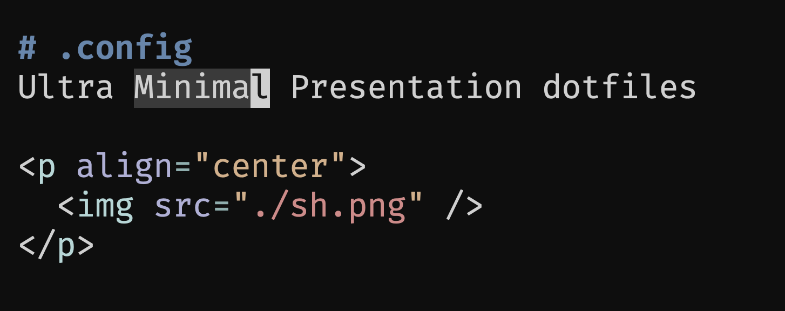

# .config
Ultra Minimal Presentation dotfiles. These bad boys handle Typst like a dream. 
I'm trying to clean them up but it's `requiring` more than a lua project with a lot of code splitting.  

  

